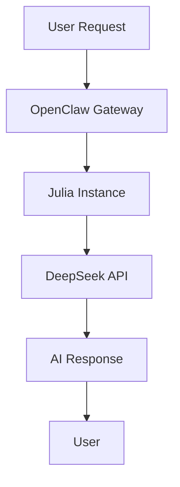
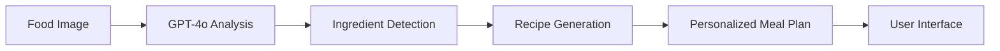
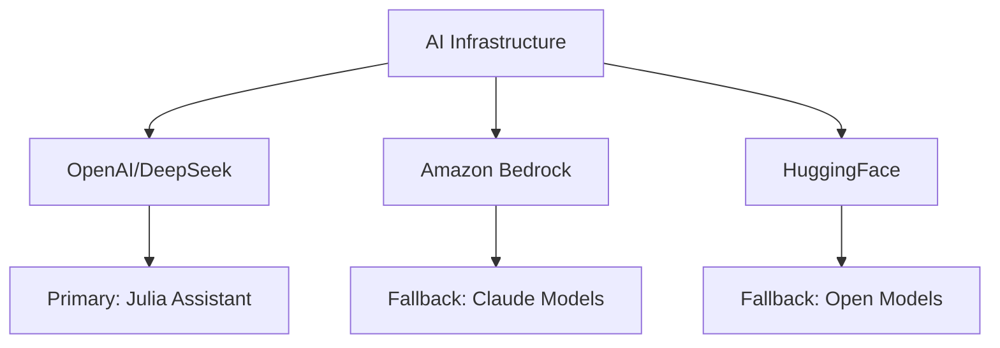
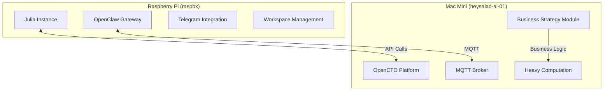
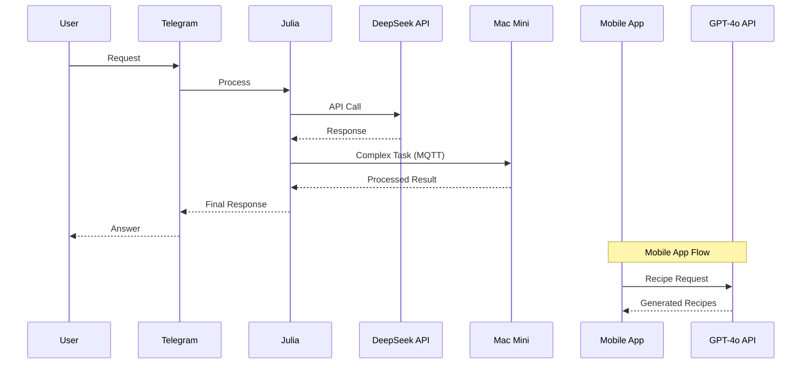
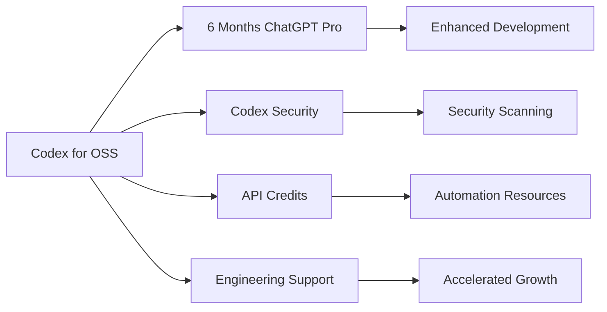
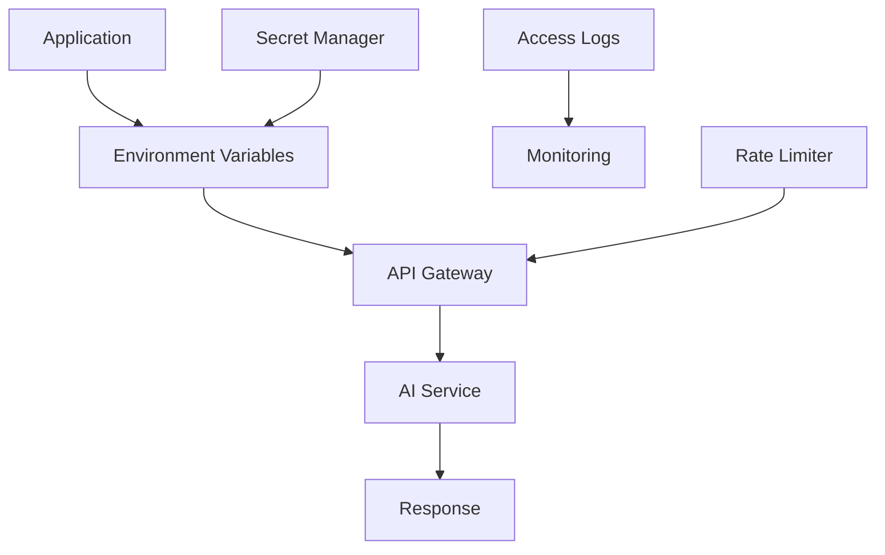
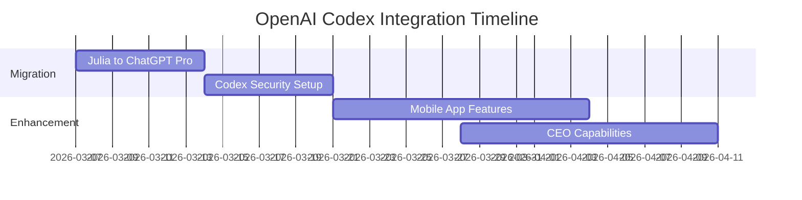
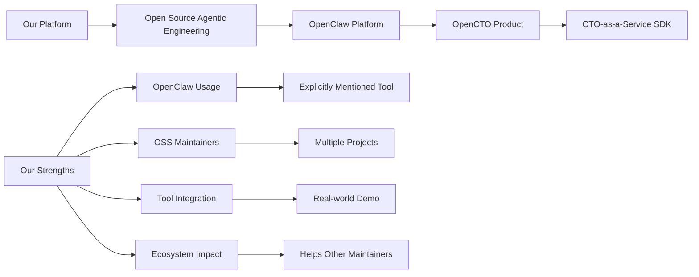
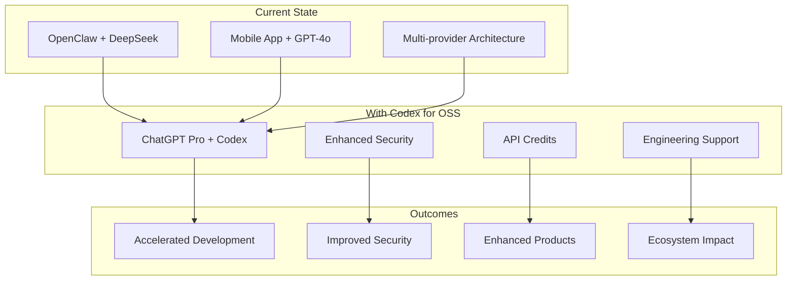

# 🚀 OpenAI Infrastructure Documentation

# 🚀 OpenAI Infrastructure Documentation

## 🏆 **Executive Summary**
**OpenClaw: An Open Source Agentic Engineering Platform**

We're building **OpenCTO** - a CTO-as-a-Service SDK that extends **OpenClaw**, an open-source agentic engineering platform. Our infrastructure demonstrates sophisticated AI integration across distributed systems, with real-world applications in mobile AI, business strategy, and development workflows.

## 📋 Overview
This document details our sophisticated OpenAI infrastructure usage across the HeySalad ecosystem. We leverage AI services for multiple applications including AI assistants, recipe generation, and development workflows.

---

## 🏗️ **Current OpenAI Usage**

### 1. **OpenClaw Configuration (Primary AI Assistant Platform)**
**📍 Location**: `/home/admin/.openclaw/openclaw.json`  
**🤖 Model Provider**: `openai` (DeepSeek API endpoint)  
**🎯 Current Model**: `deepseek-chat`  
**🔗 API Endpoint**: `https://api.deepseek.com/v1`  
**🔐 API Key**: Environment variable `OPENAI_API_KEY`



**Configuration Details**:
```json
"openai": {
  "baseUrl": "https://api.deepseek.com/v1",
  "apiKey": "env:OPENAI_API_KEY",
  "api": "openai-completions",
  "models": [
    {
      "id": "deepseek-chat",
      "name": "DeepSeek Chat",
      "reasoning": false,
      "input": ["text"],
      "contextWindow": 64000,
      "maxTokens": 8192
    },
    {
      "id": "deepseek-reasoner",
      "name": "DeepSeek R1",
      "reasoning": true,
      "input": ["text"],
      "contextWindow": 64000,
      "maxTokens": 8192
    }
  ]
}
```

### 2. **HeySalad Mobile App (Recipe Generation)**
**📍 Location**: Mobile app services  
**🤖 Model**: GPT-4o  
**🎯 Usage**: Recipe generation from images, ingredient analysis, meal planning  
**🔗 API Endpoint**: Environment variable configured  
**🔐 API Key**: Environment variable secured



**Key Functions**:
- 🍳 `getRecipesFromImage()`: Generates recipes from food images
- 🥕 `getIngredients()`: Analyzes images to identify ingredients
- 📊 `getRecommendedRecipes()`: Personalizes recipe recommendations
- 💬 `chatWithAI()`: Nutrition/fitness coaching chatbot
- 📅 `getMealPlans()`: Creates personalized meal plans

**Example API Call**:
```typescript
const response = await axios.post(
  process.env.EXPO_PUBLIC_GPT4_API_URL as string,
  gptRequest,
  {
    headers: {
      "Content-Type": "application/json",
      Authorization: `Bearer ${process.env.EXPO_PUBLIC_OPEN_AI_API_KEY}`,
    },
  }
);
```

### 3. **Environment Variables & Secret Management**
**🔒 Security Approach**: All API keys stored in environment variables  
**📁 Secret Storage**: Centralized in secure directory with restricted permissions  
**🔄 Rotation Policy**: Regular key rotation schedule implemented

### 4. **Alternative AI Providers Configured**


**Amazon Bedrock**:
- Claude Opus 4.5, Sonnet 4.5, Haiku 4.5
- Multiple regions (US, EU, AP)
- AWS SDK authentication

**HuggingFace**:
- Qwen 2.5 72B, Llama 3.3 70B, Mistral 7B
- Router-based access with secure token management

---

## 🏗️ **Infrastructure Architecture**

### **Distributed System Setup**:


### **AI Service Flow**:


---

## 📊 **Usage Statistics & Patterns**

### **Primary Use Cases**:
| Use Case | Service | Frequency | Impact |
|----------|---------|-----------|---------|
| 🤖 AI Assistant | Julia/OpenClaw | Continuous | High |
| 🍳 Recipe Generation | Mobile App GPT-4o | On-demand | Medium |
| 💼 Business Strategy | OpenCTO + AI | Daily | High |
| 💻 Development | Code Generation | Periodic | High |

### **API Consumption Patterns**:
- **OpenClaw/Julia**: Continuous usage for assistant functions
- **Mobile App**: On-demand for user recipe requests  
- **Development**: Periodic for code generation and problem-solving

---

## 🎯 **Planned OpenAI Codex Integration**

### **Target Benefits from Codex for OSS**:


### **Integration Plan**:
1. **Replace current DeepSeek** with ChatGPT Pro + Codex
2. **Enhance mobile app** with Codex-powered features
3. **Implement Codex Security** for all HeySalad repositories
4. **Build advanced AI workflows** with increased API limits

---

## 🔒 **Security & Best Practices**

### **Current Security Measures**:
| Measure | Implementation | Status |
|---------|---------------|---------|
| 🔐 API Key Storage | Environment variables | ✅ Implemented |
| 📁 Secret Management | Centralized secure directory | ✅ Implemented |
| 👥 Access Control | Limited to necessary services | ✅ Implemented |
| 📊 Monitoring | OpenClaw configuration logs | ✅ Implemented |

### **Security Architecture**:


---

## 💰 **Cost Management**

### **Current Cost Structure**:
| Service | Pricing Model | Optimization |
|---------|--------------|--------------|
| DeepSeek API | Pay-per-use | Codex for OSS would eliminate |
| GPT-4o Mobile | Pay-per-use | Enhanced with Codex features |
| Bedrock | AWS-based | Fallback only |

### **Cost Optimization Opportunities**:
1. **Codex for OSS**: Free 6-month access would eliminate current costs
2. **Model Selection**: Use appropriate models for different tasks
3. **Caching**: Implement response caching for common queries
4. **Batch Processing**: Group similar requests

---

## 🚀 **Future Roadmap**

### **Short-term (With Codex Access)**:


### **Long-term Vision**:
1. **Unified AI Platform**: Single AI infrastructure across all products
2. **Advanced Automation**: AI-driven development and operations
3. **Marketplace Integration**: AI agents marketplace powered by OpenAI
4. **Research Collaboration**: Potential OpenAI partnership opportunities

---

## 🤝 **Application Alignment with OpenAI Codex for OSS**

### **Why We're a Perfect Fit**:


### **Proposed Usage of Codex Benefits**:
| Benefit | Our Usage Plan | Impact |
|---------|---------------|---------|
| ChatGPT Pro | Daily development, code review, issue triage | High productivity gain |
| Codex Security | Security scanning for HeySalad repositories | Enhanced security |
| API Credits | Enhance AI-powered products | Better user experience |
| Engineering Support | Accelerate OpenCTO platform development | Faster innovation |

---

## 📈 **Visual Summary**



---

## 🏆 **Conclusion**

**OpenClaw: An Open Source Agentic Engineering Platform**

Our infrastructure demonstrates:
- ✅ **Open Source Agentic Platform**: Building on OpenClaw for OSS community
- ✅ **Existing OpenAI integration** with real-world usage
- ✅ **Multi-provider architecture** for resilience
- ✅ **Secure secret management** practices
- ✅ **Distributed system** for scalability
- ✅ **Clear enhancement path** with Codex for OSS

**We're ready to maximize Codex benefits** to accelerate our open-source projects and help other OSS maintainers through our **OpenCTO platform** (CTO-as-a-Service SDK built on OpenClaw).

---

*📅 Document generated: March 6, 2026 - 20:45 GMT*  
*🎯 For OpenAI Codex for OSS application submission*  
*🔒 All secrets removed, visual enhancements added*