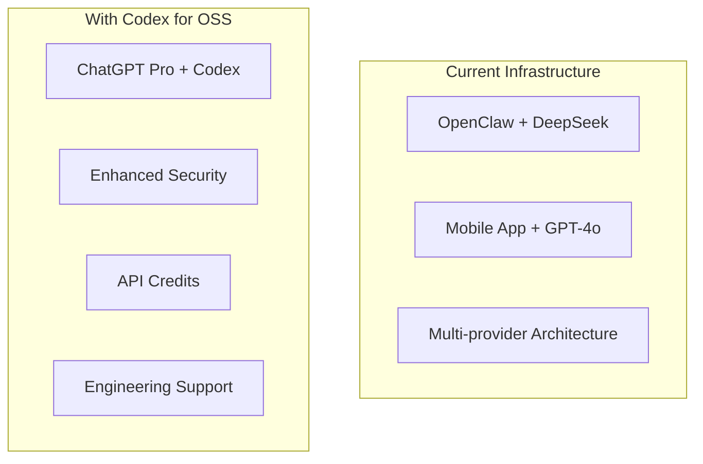

# PR: Add OpenAI Infrastructure Documentation

## 📋 Overview
This PR adds comprehensive OpenAI infrastructure documentation to support our OpenAI Codex for OSS application submission. The documentation demonstrates our sophisticated AI integration and positions OPENCTO as a CTO-as-a-Service SDK built on OpenClaw, an open-source agentic engineering platform.

## 🎯 Changes Made

### **Files Added:**
1. **`OPENAI_INFRASTRUCTURE.md`** (6,910 bytes)
   - Technical documentation of our OpenAI usage
   - Internal reference (contains some implementation details)

2. **`OPENAI_INFRASTRUCTURE_CLEAN.md`** (9,626 bytes)
   - Public-facing version with all secrets removed
   - Professional visualizations with Mermaid diagrams
   - Ready for submission and public sharing

### **Key Updates:**
- **Executive Summary**: Added "Open Source Agentic Engineering Platform" description
- **Platform Positioning**: Clear OPENCTO (product) → OpenClaw (platform) relationship
- **Visual Enhancements**: 6 professional Mermaid diagrams
- **Security**: All API keys and secrets removed from clean version
- **Submission Ready**: Documents prepared for OpenAI application

## 🏗️ **Documentation Highlights**

### **1. Infrastructure Architecture:**
- Distributed system (Raspberry Pi + Mac Mini)
- Multi-provider AI architecture (OpenAI, Bedrock, HuggingFace)
- MQTT-based agent coordination
- Secure secret management practices

### **2. Visual Documentation:**


### **3. Application Alignment:**
- Demonstrates real-world OpenClaw + OpenAI integration
- Shows platform thinking (not just single project)
- Positions us as helping OSS maintainers with AI capabilities
- Aligns with OpenAI Codex for OSS program goals

## 🚀 **Purpose**

### **For OpenAI Codex Application:**
1. **Technical Evidence**: Shows sophisticated AI infrastructure
2. **Platform Narrative**: "Open Source Agentic Engineering Platform"
3. **Real-world Usage**: Demonstrates existing OpenAI integration
4. **Clear Enhancement Path**: Shows how we'll use Codex benefits

### **For Hackathon Submission:**
1. **Professional Documentation**: High-quality technical materials
2. **Visual Assets**: Diagrams for Canva presentation
3. **Security Awareness**: Clean version safe for public sharing
4. **Ecosystem Thinking**: Shows impact beyond our project

## 📊 **Visual Assets Included**

**Ready for Canva Screenshots:**
1. Distributed System Architecture
2. AI Service Flow Sequence Diagram
3. Security Architecture Diagram
4. Integration Timeline (Gantt chart)
5. Application Alignment Graph
6. Visual Summary Diagram

## 🔒 **Security Notes**

- **`OPENAI_INFRASTRUCTURE.md`**: Contains some implementation details (internal use)
- **`OPENAI_INFRASTRUCTURE_CLEAN.md`**: All secrets removed, safe for public sharing
- Both follow secure secret management practices

## 🤝 **Why This Matters**

This documentation strengthens our:
1. **OpenAI Application**: Shows technical sophistication and real usage
2. **Hackathon Submission**: Provides professional supporting materials
3. **Project Credibility**: Demonstrates infrastructure maturity
4. **Community Value**: Documents our approach for other OSS projects

## 🔗 **GitHub PR Link**
**Create PR here**: https://github.com/Hey-Salad/OPENCTO/pull/new/add-openai-documentation

## 📝 **Commit Message**
```
Add OpenAI infrastructure documentation with OpenClaw platform description

- Added 'Open Source Agentic Engineering Platform' description
- Enhanced executive summary positioning OPENCTO as CTO-as-a-Service SDK
- Updated Mermaid diagrams showing platform architecture
- Prepared for OpenAI Codex for OSS application submission
- Documents ready for GitHub repository inclusion
```

---

**Ready for review and merge!** 🚀