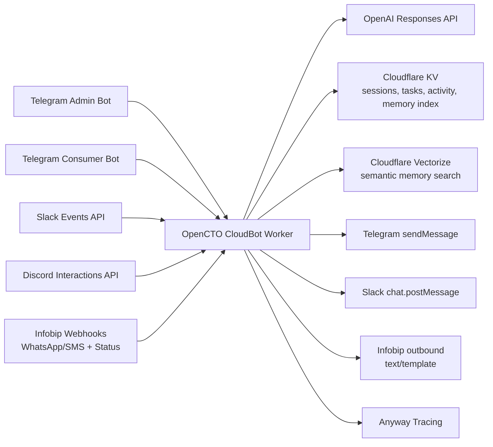

# OpenCTO CloudBot Worker

Cloudflare Worker that powers OpenCTO conversational operations across Telegram, Slack, Discord, WhatsApp, and SMS.

It uses one shared orchestration path with persistent memory, task tracking, activity logs, optional vector RAG, coding-agent dispatch, and Android relay support.

## Core Responsibilities

- Normalize inbound webhook events into channel-scoped chat sessions
- Persist activity, tasks, and memory in Cloudflare KV
- Optionally enrich context with Vectorize semantic retrieval
- Execute assistant turns with OpenAI
- Route optional coding commands into `opencto-api-worker`
- Route optional Android commands into Android control-plane endpoints
- Forward observability events to Anyway sidecar (fail-open)

## Architecture



## Prerequisites

- Node.js `>= 18`
- npm
- Wrangler CLI
- Cloudflare account with Worker + KV (and optional Vectorize)
- Channel credentials for any channel you enable

## Quick Start

### 1) Install

```bash
cd opencto/opencto-cloudbot-worker
npm install
```

### 2) Configure `wrangler.toml` vars

Minimum recommended baseline:

```toml
[vars]
OPENCTO_AGENT_MODEL = "gpt-4.1-mini"
OPENCTO_VECTOR_RAG_ENABLED = "false"
OPENCTO_ANYWAY_ENABLED = "true"
OPENCTO_SIDECAR_ENABLED = "true"
OPENCTO_SIDECAR_URL = "https://anyway-sdk-sidecar.opencto.works/trace/event"
OPENCTO_CODE_AGENT_ENABLED = "true"
OPENCTO_API_BASE_URL = "https://opencto-api.heysalad-o.workers.dev"
```

### 3) Add required secrets

```bash
wrangler secret put OPENAI_API_KEY
wrangler secret put TELEGRAM_BOT_TOKEN
wrangler secret put OPENCTO_TELEGRAM_CONSUMER_BOT_TOKEN
wrangler secret put OPENCTO_SLACK_BOT_TOKEN
wrangler secret put OPENCTO_SLACK_SIGNING_SECRET
wrangler secret put OPENCTO_DISCORD_PUBLIC_KEY
wrangler secret put OPENCTO_INFOBIP_API_KEY
wrangler secret put OPENCTO_INFOBIP_WEBHOOK_TOKEN
wrangler secret put OPENCTO_ANYWAY_API_KEY
wrangler secret put OPENCTO_SIDECAR_TOKEN
wrangler secret put OPENCTO_ADMIN_TOKEN
wrangler secret put OPENCTO_INTERNAL_API_TOKEN
```

### 4) Optional Vectorize setup

```bash
wrangler vectorize create opencto-memory-index --dimensions=1536 --metric=cosine
```

Add binding:

```toml
[[vectorize]]
binding = "OPENCTO_VECTOR_INDEX"
index_name = "opencto-memory-index"
```

### 5) Run or deploy

```bash
npm run dev
# or
npm run deploy
```

## Event Flow

1. Channel webhook receives user message/event.
2. Worker normalizes scope (`telegram:<id>`, `slack:<team>:<channel>:<thread>`, `infobip:whatsapp:<phone>`).
3. Event is logged to daily activity in KV.
4. Command handling runs first (`/help`, `/remember`, `/task`, `/tasks`, `/daily`, `/code`, `/android`).
5. Non-command turns build context from memory and optional semantic retrieval.
6. OpenAI generates response.
7. Worker replies to the source channel.
8. Response and status are persisted and mirrored to observability paths.

## Channel Configuration

### Telegram

- Admin webhook: `/webhook/telegram`
- Consumer webhook: `/webhook/telegram-consumer`

```bash
curl -sS "https://api.telegram.org/bot<ADMIN_TOKEN>/setWebhook?url=https://<worker-domain>/webhook/telegram"
curl -sS "https://api.telegram.org/bot<CONSUMER_TOKEN>/setWebhook?url=https://<worker-domain>/webhook/telegram-consumer"
```

### Slack

- Request URL: `https://<worker-domain>/webhook/slack`
- Required events: `app_mention`, `message.channels`, `message.groups`, `message.im`
- Bot scope: `chat:write`

### Discord

- Interactions URL: `https://<worker-domain>/webhook/discord`
- Signature key secret: `OPENCTO_DISCORD_PUBLIC_KEY`
- Optional channel/guild allowlists via env vars

### Infobip (WhatsApp/SMS)

- WhatsApp webhook: `https://<worker-domain>/webhook/infobip/whatsapp?token=<OPENCTO_INFOBIP_WEBHOOK_TOKEN>`
- SMS webhook: `https://<worker-domain>/webhook/infobip/sms?token=<OPENCTO_INFOBIP_WEBHOOK_TOKEN>`

## Worker API Endpoints

- `GET /health`
- `POST /api/log-activity`
- `POST /api/tasks`
- `GET /api/tasks?chatId=<id>&status=open|done`
- `GET /api/activity/daily?chatId=<id>&date=YYYY-MM-DD`
- `GET /api/status?chatId=<id>&focus=general|android`

If `OPENCTO_ADMIN_TOKEN` is set, include `x-opencto-admin-token` for `/api/*` routes.

## Coding Agent Integration

When `OPENCTO_CODE_AGENT_ENABLED=true`, chat channels can start trusted code runs.

Supported commands:

- `/code help`
- `/code run <repo scope> | <goal>`
- `/code status [run_id]`

Supported repo scopes:

- `opencto/opencto-api-worker`
- `opencto/opencto-dashboard`
- `opencto/mobile-app`
- `opencto/opencto-cloudbot-worker`

Upstream internal API calls:

- `POST /api/v1/internal/codebase/runs?dispatch=async`
- `GET /api/v1/internal/codebase/runs/:id`
- `GET /api/v1/internal/codebase/runs/:id/events`

## Android Relay Integration

When `OPENCTO_ANDROID_AUTODEV_ENABLED=true`, channels can relay Android intents:

- `/android status`
- `/android screenshot`
- `/android video 20`
- `/android task <goal>`

Target control-plane endpoints:

- `GET /healthz`
- `GET /v1/worker/status`
- `POST /v1/worker/tasks`
- `POST /v1/worker/capture/screenshot`
- `POST /v1/worker/capture/video`

If behind Cloudflare Access, set:

```bash
wrangler secret put OPENCTO_ANDROID_AUTODEV_CF_ACCESS_CLIENT_ID
wrangler secret put OPENCTO_ANDROID_AUTODEV_CF_ACCESS_CLIENT_SECRET
```

## Operational Notes

- Tracing is fail-open and must never block replies.
- Sidecar forwarding is fail-open and includes trace IDs for correlation.
- Python sidecar service docs: `sidecar/README.md`.

## Quick Demo

1. Send `Hi` to `@OpenCTO_ai_bot`.
2. Send `/task add Ship architecture demo`.
3. Send `/tasks`.
4. Send a WhatsApp message (if configured).
5. Verify activity with `/api/activity/daily` for the channel scope.

## How-To Guides

### How to activate one Telegram bot end-to-end

1. Configure `TELEGRAM_BOT_TOKEN` secret.
2. Deploy the worker (`npm run deploy`).
3. Set Telegram webhook to `/webhook/telegram`.
4. Send `/help` to the bot.
5. Confirm inbound + outbound activity is persisted in KV and visible via `/api/activity/daily`.

### How to enable coding commands

1. Set `OPENCTO_CODE_AGENT_ENABLED=true`.
2. Set `OPENCTO_API_BASE_URL` and `OPENCTO_INTERNAL_API_TOKEN`.
3. Send `/code run <repo scope> | <goal>`.
4. Track run status with `/code status`.

### How to enable Android relay

1. Set `OPENCTO_ANDROID_AUTODEV_ENABLED=true`.
2. Set Android control-plane base URL variables.
3. If protected by Cloudflare Access, set client ID/secret secrets.
4. Send `/android status` and `/android screenshot` to confirm relay path.

## References (Chicago 17th, Bibliography)

Cloudflare. n.d. "Cloudflare Workers." Cloudflare Docs. Accessed March 6, 2026. https://developers.cloudflare.com/workers/.

Cloudflare. n.d. "Vectorize." Cloudflare Docs. Accessed March 6, 2026. https://developers.cloudflare.com/vectorize/.

Discord. n.d. "Receiving and Responding." Discord Developer Docs. Accessed March 6, 2026. https://discord.com/developers/docs/interactions/receiving-and-responding.

OpenAI. n.d. "Responses API." OpenAI Platform Docs. Accessed March 6, 2026. https://platform.openai.com/docs/api-reference/responses.

Slack. n.d. "Events API." Slack API Docs. Accessed March 6, 2026. https://api.slack.com/apis/events-api.

Telegram. n.d. "Bot API: setWebhook." Accessed March 6, 2026. https://core.telegram.org/bots/api#setwebhook.
