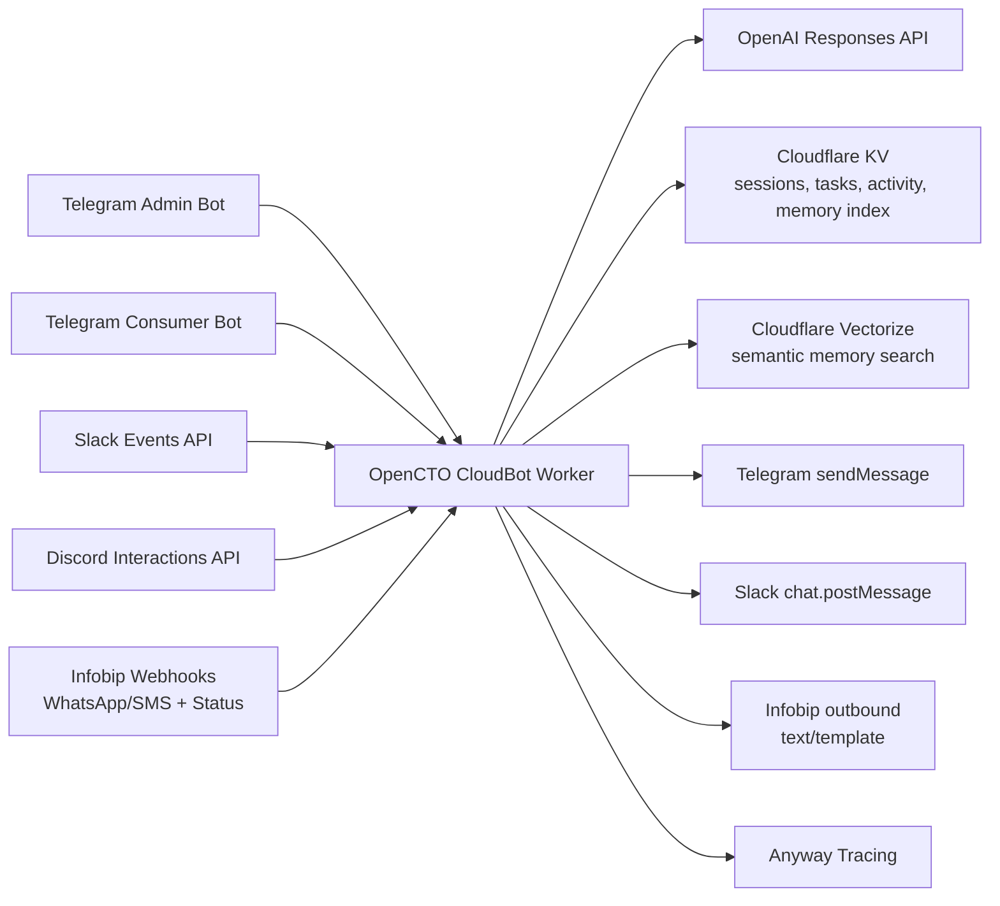

# OpenCTO CloudBot Worker

Cloudflare Worker powering OpenCTO across Telegram, Slack, Discord, WhatsApp, and SMS.
It runs a shared AI orchestration path with persistent memory, task management, daily activity logs, and optional semantic RAG.

## Architecture



## Information Flow

1. Channel webhook receives a user event.
2. Worker normalizes event into a channel scope (`telegram:<id>`, `slack:<team>:<channel>:<thread>`, `infobip:whatsapp:<phone>`).
3. User event is logged to daily activity (`KV`).
4. Shared chat turn executes, with direct status interception for grounded progress questions.
5. Commands (`/help`, `/remember`, `/task`, `/tasks`, `/daily`) are handled if present.
6. Otherwise, RAG context is built from lexical memory (`KV`) and semantic memory (`Vectorize`, if enabled).
7. OpenAI generates assistant response.
8. Worker sends reply to originating channel.
9. Bot reply (or error/status) is logged to activity for observability and replay.

## Channel Behavior

- Telegram: admin webhook at `/webhook/telegram`, consumer webhook at `/webhook/telegram-consumer`; each replies with its own bot token.
- Slack: verifies signature/timestamp, handles mentions/DMs/active thread replies, and keeps thread context in KV.
- Discord: verifies Ed25519 request signature, accepts Interactions at `/webhook/discord`, and reuses shared command/chat logic.
- Infobip WhatsApp/SMS: inbound message webhooks, delivery/read callback logging, 24h WhatsApp free-form window, and template fallback outside the window.

## Data Model (KV / Vectorize)

- Session: short conversational memory (`session:<scope>`)
- Persistent memory entries + memory index (`memory:*`, `memory_index:*`)
- Tasks and task index (`task:*`, `task_index:*`)
- Activity timeline (`activity:<scope>:YYYY-MM-DD`)
- Slack active thread markers (`slack_thread:*`)
- Infobip last inbound marker (`infobip_last_inbound:*`)
- Semantic vectors in `OPENCTO_VECTOR_INDEX` (optional)

## Setup

1. Install:

```bash
npm install
```

2. Configure `wrangler.toml` bindings/vars:

```toml
[vars]
OPENCTO_AGENT_MODEL = "gpt-4.1-mini"
OPENCTO_AGENT_MODEL_PLANNER = "gpt-5.4"
OPENCTO_AGENT_MODEL_EXECUTOR = "gpt-5.3-codex"
OPENCTO_AGENT_MODEL_REVIEWER = "gemini-2.5-pro"
OPENCTO_VECTOR_RAG_ENABLED = "true"
OPENCTO_EMBED_MODEL = "text-embedding-3-small"
OPENCTO_ANYWAY_ENABLED = "true"
OPENCTO_ANYWAY_ENDPOINT = "https://trace-dev-collector.anyway.sh/"
OPENCTO_SIDECAR_ENABLED = "true"
OPENCTO_SIDECAR_URL = "https://anyway-sdk-sidecar.opencto.works/trace/event"
OPENCTO_CODE_AGENT_ENABLED = "true"
OPENCTO_API_BASE_URL = "https://opencto-api.heysalad-o.workers.dev"
OPENCTO_DISCORD_ALLOWED_CHANNELS = "123456789012345678,234567890123456789"
OPENCTO_DISCORD_ALLOWED_GUILDS = "345678901234567890"
OPENCTO_ANDROID_AUTODEV_ENABLED = "true"
OPENCTO_ANDROID_AUTODEV_BASE_URL = "https://android-lab.heysalad.app"
OPENCTO_ANDROID_AUTODEV_PUBLIC_BASE_URL = "https://android-lab.heysalad.app"

OPENCTO_INFOBIP_BASE_URL = "https://<your-subdomain>.api.infobip.com"
OPENCTO_INFOBIP_WHATSAPP_FROM = "<approved_whatsapp_sender>"
OPENCTO_INFOBIP_SMS_FROM = "<sms_sender_id>"
OPENCTO_INFOBIP_WHATSAPP_TEMPLATE_NAME = "<template_name_optional>"
OPENCTO_INFOBIP_WHATSAPP_TEMPLATE_LANGUAGE = "en"

OPENCTO_SLACK_ALLOWED_CHANNELS = "C12345,C67890"
```

3. Add secrets:

```bash
wrangler secret put OPENAI_API_KEY
wrangler secret put TELEGRAM_BOT_TOKEN
wrangler secret put OPENCTO_TELEGRAM_CONSUMER_BOT_TOKEN
wrangler secret put OPENCTO_SLACK_BOT_TOKEN
wrangler secret put OPENCTO_SLACK_SIGNING_SECRET
wrangler secret put OPENCTO_DISCORD_PUBLIC_KEY
wrangler secret put OPENCTO_INFOBIP_API_KEY
wrangler secret put OPENCTO_INFOBIP_WEBHOOK_TOKEN
wrangler secret put OPENCTO_ANYWAY_API_KEY
wrangler secret put OPENCTO_SIDECAR_TOKEN
wrangler secret put OPENCTO_ADMIN_TOKEN
wrangler secret put OPENCTO_INTERNAL_API_TOKEN
wrangler secret put OPENCTO_ANDROID_AUTODEV_CF_ACCESS_CLIENT_ID
wrangler secret put OPENCTO_ANDROID_AUTODEV_CF_ACCESS_CLIENT_SECRET
```

4. Optional semantic RAG (Vectorize):

```bash
wrangler vectorize create opencto-memory-index --dimensions=1536 --metric=cosine
```

```toml
[[vectorize]]
binding = "OPENCTO_VECTOR_INDEX"
index_name = "opencto-memory-index"
```

5. Deploy:

```bash
wrangler deploy
```

## Webhook Configuration

- Telegram admin bot:

```bash
curl -sS "https://api.telegram.org/bot<ADMIN_TOKEN>/setWebhook?url=https://<worker-domain>/webhook/telegram"
```

- Telegram consumer bot:

```bash
curl -sS "https://api.telegram.org/bot<CONSUMER_TOKEN>/setWebhook?url=https://<worker-domain>/webhook/telegram-consumer"
```

- Slack Events API request URL: `https://<worker-domain>/webhook/slack`
- Slack required events: `app_mention`, `message.channels`, `message.groups`, `message.im`
- Slack bot scope: `chat:write`
- Discord Interactions Endpoint URL: `https://<worker-domain>/webhook/discord`
- Discord secret required: `OPENCTO_DISCORD_PUBLIC_KEY` (from Discord Developer Portal)
- Optional hardening: set `OPENCTO_DISCORD_ALLOWED_GUILDS` and `OPENCTO_DISCORD_ALLOWED_CHANNELS` (comma-separated IDs)
- Infobip WhatsApp webhook: `https://<worker-domain>/webhook/infobip/whatsapp?token=<OPENCTO_INFOBIP_WEBHOOK_TOKEN>`
- Infobip SMS webhook: `https://<worker-domain>/webhook/infobip/sms?token=<OPENCTO_INFOBIP_WEBHOOK_TOKEN>`

## API Endpoints

- `GET /health`
- `POST /api/log-activity` body: `{ "chatId": string|number, "type": string, "text": string }`
- `POST /api/tasks` body: `{ "chatId": string|number, "title": string, "priority": "low|medium|high" }`
- `GET /api/tasks?chatId=<id>&status=open|done`
- `GET /api/activity/daily?chatId=<id>&date=YYYY-MM-DD`
- `GET /api/status?chatId=<id>&focus=general|android`

If `OPENCTO_ADMIN_TOKEN` is set, include `x-opencto-admin-token` on `/api/*`.

## Telegram Commands

- `/help`
- `/remember <text>`
- `/task add <title>`
- `/task done <task_id>`
- `/tasks`
- `/status`
- `/daily`
- `/code help`
- `/code run opencto/opencto-api-worker | smoke the build and test flow`
- `/code status`
- `/android help`
- `/android status`
- `/android screenshot`
- `/android video 20`
- `/android task Open Settings and capture a screenshot`

## Coding Agent

If `OPENCTO_CODE_AGENT_ENABLED=true`, Slack and the other channel surfaces can start trusted
repo-validation runs through the internal API worker contract.

Supported coding commands:
- `/code help`
- `/code run <repo scope> | <goal>`
- `/code status [run_id]`

Supported repo scopes:
- `opencto/opencto-api-worker`
- `opencto/opencto-dashboard`
- `opencto/mobile-app`
- `opencto/opencto-cloudbot-worker`

Worker requirements for the coding path:
- `OPENCTO_API_BASE_URL`
- `OPENCTO_INTERNAL_API_TOKEN`

The worker calls:
- `POST /api/v1/internal/codebase/runs?dispatch=async`
- `GET /api/v1/internal/codebase/runs/:id`
- `GET /api/v1/internal/codebase/runs/:id/events`

Natural-language repo requests are routed into this path when they clearly target one of the
supported scopes. Android relay requests remain device-only and are rejected for repo/PR workflows.

## Android Relay

If `OPENCTO_ANDROID_AUTODEV_ENABLED=true`, Telegram/Slack/Discord/Infobip chat turns can
forward Android requests to the live `android-autodev` control plane behind Cloudflare Access.

Supported relay behaviors:
- explicit commands via `/android ...`
- natural-language interception for common intents:
  - device status
  - capture screenshot
  - record video
  - queue Android task goals

The worker targets these live control-plane endpoints:
- `GET /healthz`
- `GET /v1/worker/status`
- `POST /v1/worker/tasks`
- `POST /v1/worker/capture/screenshot`
- `POST /v1/worker/capture/video`

The worker also answers grounded progress questions such as `where are we with android development?`
from the current task list, recent activity log, and Android relay state when configured.

If the Android relay is behind Cloudflare Zero Trust, also configure:

```bash
wrangler secret put OPENCTO_ANDROID_AUTODEV_CF_ACCESS_CLIENT_ID
wrangler secret put OPENCTO_ANDROID_AUTODEV_CF_ACCESS_CLIENT_SECRET
```

When set, the worker forwards:
- `CF-Access-Client-Id`
- `CF-Access-Client-Secret`

on Android control-plane requests.

`OPENCTO_ANDROID_AUTODEV_TOKEN` is only needed if you also enforce a separate app token on the
Android side. It is not the same as the Cloudflare Access service token.

## Quick Demo Script

1. Open `@OpenCTO_ai_bot` and send `Hi`.
2. Send `/task add Ship architecture demo`.
3. Send `/tasks` to confirm task persistence.
4. Send a WhatsApp message.
5. Verify status events with `GET /api/activity/daily?chatId=infobip:whatsapp:<number>&date=<today>`.

## Notes

- Tracing is fail-open: telemetry failures never block channel replies.
- Sidecar forwarding is fail-open, carries the worker trace id in event metadata, and uses `OPENCTO_SIDECAR_TOKEN` via `x-opencto-sidecar-token`.
- Python tracing sidecar lives in `sidecar/`.
